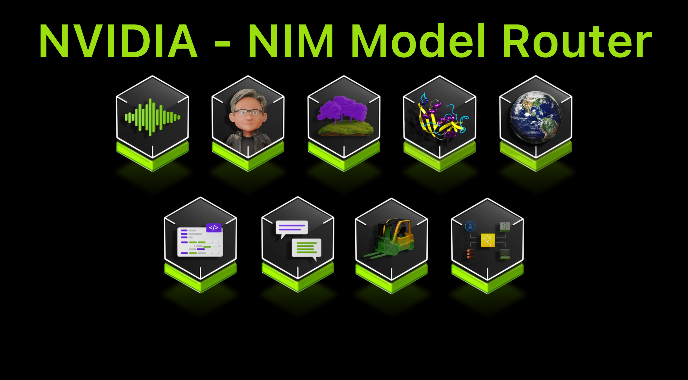
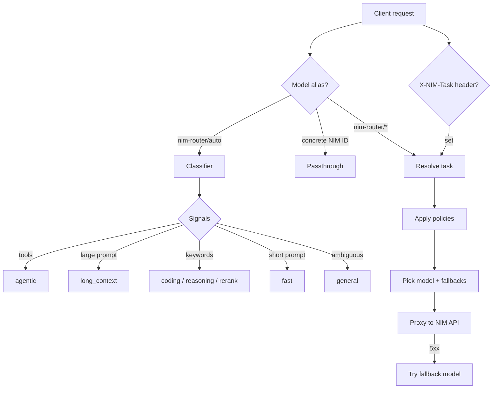

<p align="center">
  
</p>

# NIM Model Router

[](https://github.com/cobusgreyling/nim-model-router/actions/workflows/ci.yml)

**OpenAI-compatible proxy that routes requests to the best NVIDIA NIM model by task.**

NVIDIA's [NIM catalog](https://build.nvidia.com/models) has 100+ models. Picking the right one for each request is tedious. This router sits in front of the NIM API and automatically selects a model based on what you're asking for — fast chat, agentic tool use, deep reasoning, coding, embeddings, reranking, and more.

Drop it into any OpenAI SDK client by changing `base_url`. No other code changes required.

## Quick start

```bash
git clone https://github.com/cobusgreyling/nim-model-router.git
cd nim-model-router
python -m venv .venv && source .venv/bin/activate
pip install -e ".[dev]"

cp .env.example .env
# Edit .env and set NVIDIA_API_KEY

nim-router serve
```

The proxy listens on `http://127.0.0.1:8080`. API docs: `http://127.0.0.1:8080/docs`

### Docker

```bash
cp .env.example .env  # set NVIDIA_API_KEY
docker compose up --build
```

## Usage

### Auto-routing (recommended)

```python
from openai import OpenAI

client = OpenAI(
    base_url="http://127.0.0.1:8080/v1",
    api_key="local",  # not used — router injects NVIDIA_API_KEY upstream
)

response = client.chat.completions.create(
    model="nim-router/auto",
    messages=[{"role": "user", "content": "Build a Python agent with tool calling"}],
)
print(response.choices[0].message.content)
```

### Explicit task aliases

| Model alias | Task | Default NIM model |
|-------------|------|-------------------|
| `nim-router/auto` | Classify automatically | — |
| `nim-router/fast` | Short Q&A, classification | `meta/llama-3.1-8b-instruct` |
| `nim-router/general` | Ambiguous general chat | `nvidia/nemotron-3-nano-30b-a3b` |
| `nim-router/agentic` | Tool use, agents | `nvidia/nemotron-3-super-120b-a12b` |
| `nim-router/reasoning` | Deep analysis | `nvidia/nemotron-3-ultra-550b-a55b` |
| `nim-router/long-context` | Large documents | `nvidia/nemotron-3-super-120b-a12b` |
| `nim-router/coding` | Code generation | `nvidia/llama-3.3-nemotron-super-49b-v1.5` |
| `nim-router/embedding` | Embeddings | `nvidia/llama-nemotron-embed-1b-v2` |
| `nim-router/rerank` | Reranking | `nvidia/llama-nemotron-rerank-1b-v2` |

### Force a task via header

```bash
curl http://127.0.0.1:8080/v1/chat/completions \
  -H "Content-Type: application/json" \
  -H "X-NIM-Task: reasoning" \
  -d '{
    "model": "nim-router/auto",
    "messages": [{"role": "user", "content": "Analyze the root cause step by step"}]
  }'
```

### Rerank

```bash
curl http://127.0.0.1:8080/v1/rerank \
  -H "Content-Type: application/json" \
  -d '{
    "model": "nim-router/rerank",
    "query": "What is NVIDIA NIM?",
    "documents": ["NIM provides optimized inference...", "Unrelated text"],
    "top_n": 2
  }'
```

### Passthrough to a specific NIM model

If you pass a concrete NIM model ID (e.g. `meta/llama-3.1-70b-instruct`), the router forwards it unchanged.

## How routing works



Classifier signals:

- **Tools present** → `agentic`
- **Large prompt** (>12k estimated tokens, tiktoken) → `long_context`
- **Reasoning keywords** → `reasoning`
- **Coding keywords** → `coding`
- **Rerank keywords / query+documents** → `rerank`
- **Short prompt** (≤120 chars) → `fast`
- **Ambiguous** → `general` (not ultra-expensive `agentic`)

Policies can downgrade ultra models for short prompts and route low-confidence requests to `general`.

## CLI

```bash
# Start proxy
nim-router serve --port 8080 --config src/nim_model_router/models.yaml

# Dry-run routing (no API call)
nim-router route "refactor this Python function" --json
nim-router route "hello"
nim-router route "plan a multi-step agent" --tools

# Show registry
nim-router models

# Sync model suggestions from NIM catalog
nim-router catalog-sync --task coding

# Print OpenAI SDK example
nim-router client-example
```

## Observability

Every proxied response includes routing metadata:

| Header | Example |
|--------|---------|
| `X-NIM-Routed-Task` | `agentic` |
| `X-NIM-Routed-Model` | `nvidia/nemotron-3-super-120b-a12b` |
| `X-NIM-Router-Reason` | `request includes tool definitions` |
| `X-NIM-Router-Confidence` | `0.950` |

```bash
# Live stats
curl http://127.0.0.1:8080/v1/router/stats

# Task registry + cost summary
curl http://127.0.0.1:8080/v1/router/tasks

# Reload config without restart
curl -X POST http://127.0.0.1:8080/v1/router/reload

# Prometheus metrics
curl http://127.0.0.1:8080/metrics

# Dry-run endpoint
curl -X POST http://127.0.0.1:8080/v1/router/dry-run \
  -H "Content-Type: application/json" \
  -d '{"messages":[{"role":"user","content":"debug my rust code"}]}'
```

Set `ROUTER_LOG_PATH=data/router.log.jsonl` to persist request logs.

## Environment variables

| Variable | Default | Description |
|----------|---------|-------------|
| `NVIDIA_API_KEY` | — | Required upstream API key |
| `NIM_BASE_URL` | `https://integrate.api.nvidia.com/v1` | NIM API base URL |
| `ROUTER_HOST` | `127.0.0.1` | Proxy bind host |
| `ROUTER_PORT` | `8080` | Proxy bind port |
| `ROUTER_CONFIG` | bundled `models.yaml` | Custom registry path |
| `ROUTER_LOG_PATH` | — | JSONL log file path |
| `ROUTER_API_KEY` | — | Optional client auth key |
| `UPSTREAM_MAX_RETRIES` | `3` | Retries for 429/5xx |
| `UPSTREAM_RETRY_BACKOFF_SECONDS` | `0.5` | Retry backoff base |
| `ENABLE_PROMETHEUS` | `true` | Expose `/metrics` |
| `HEALTH_CHECK_UPSTREAM` | `false` | Include upstream status in `/health` |
| `MAX_REQUEST_BODY_BYTES` | `10485760` | Max request body size |

## Customizing models

Edit `src/nim_model_router/models.yaml` (or set `ROUTER_CONFIG`):

```yaml
tasks:
  agentic:
    model: nvidia/nemotron-3-nano-30b-a3b
    fallbacks:
      - general
      - fast
    extra_body:
      enable_thinking: true
      reasoning_budget: 2048
    ab_test:
      enabled: false
      variants:
        - model: nvidia/nemotron-3-nano-30b-a3b
          weight: 50
        - model: nvidia/nemotron-3-super-120b-a12b
          weight: 50

classifier:
  use_llm_classifier: false  # set true + pip install ".[llm-classifier]"
```

Reload at runtime: `curl -X POST http://127.0.0.1:8080/v1/router/reload`

## Integrations

### LiteLLM

```yaml
model_list:
  - model_name: nim-auto
    litellm_params:
      model: openai/nim-router/auto
      api_base: http://127.0.0.1:8080/v1
      api_key: local
```

### LangChain

```python
from langchain_openai import ChatOpenAI

llm = ChatOpenAI(
    base_url="http://127.0.0.1:8080/v1",
    api_key="local",
    model="nim-router/auto",
)
```

### Continue / Cursor (OpenAI-compatible)

```json
{
  "models": [{
    "title": "NIM Auto",
    "provider": "openai",
    "model": "nim-router/auto",
    "apiBase": "http://127.0.0.1:8080/v1",
    "apiKey": "local"
  }]
}
```

## Development

```bash
pip install -e ".[dev]"
pytest --cov=nim_model_router --cov-report=term-missing
ruff check src tests
ruff format src tests
```

See [CONTRIBUTING.md](CONTRIBUTING.md).

## Security

- Store `NVIDIA_API_KEY` in `.env` — never commit it.
- Set `ROUTER_API_KEY` before exposing the proxy beyond localhost.
- Bind to `127.0.0.1` by default. Use Docker/reverse proxy auth for production.

## License

MIT
